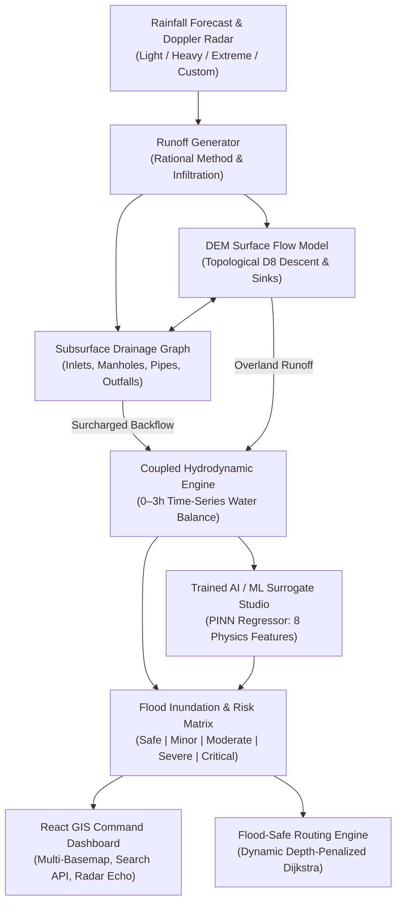

# Urban Flood Nowcasting & Flood-Safe Routing System

An end-to-end urban emergency management platform that takes short-term rainfall forecasts and predicts **where urban flooding will occur, how deep the water will be, which drains will surcharge, and how emergency vehicles or commuters can safely navigate around submerged roads**.

Designed as a high-performance **Hackathon MVP** that prioritizes speed (< 0.3s simulation), transparent explainability, and coupled hydrodynamic routing.

---

## 🌟 Core Pipeline & Machine Learning Integration



---

## 🚀 Key Features

1. **Hydrological Surface Runoff & DEM Flow**:
   - Vectorized D8 steepest descent routing over an elevation model.
   - Sinks, underpasses, and railway dips naturally collect pooled water.
   - 2,000 DEM grid cells processed in milliseconds using topological sorting.

2. **Drainage Network as a Directed Graph (Core Feature)**:
   - Built with **NetworkX** representing street catch basins, manholes, collector trunks, and sea outfalls.
   - Models intake throttles, pipe conveyance limits ($m^3/s$), chamber storage buffer ($m^3$), and hydraulic surcharge backflow onto streets.

3. **Trainable AI / Machine Learning Surrogate Model**:
   - **Physics-Informed Surrogate Regressor**: Trained on multi-scenario hydrodynamic runs across 8 multi-scale spatial features (elevation, slope, sinks, drain proximity, capacity, upstream accumulation).
   - Instant inference: Evaluates all 2,000 cells in **< 2 milliseconds**!
   - In-app **Model Training Studio**: Configure epochs, launch training via `POST /api/train`, monitor live $R^2$ scores ($> 94\%$), RMSE ($\pm 1.8\text{ cm}$), and inspect feature importances.
   - Switchable engine modes: Toggle between **Coupled Hydrodynamic Physics** and **Trained AI/ML Surrogate**.

4. **Multi-Provider Basemap APIs & Location Search API**:
   - Integrated Basemap Tile Providers: **CartoDB Dark Matter**, **Esri World Satellite**, **OpenTopoMap Elevation Contours**, and **OpenStreetMap**.
   - Search Autocomplete API (`GET /api/search-locations`): Search urban landmarks, subway underpasses, hospitals, and transit hubs with instant fly-to navigation.

5. **Dynamic Flood-Safe Routing Engine**:
   - Compares standard shortest-time route vs. flood-safe risk-penalized route.
   - Vehicles avoid flooded sections ($>40$ cm roads are impassable).
   - Dynamically re-routes when the user scrubs the 0–3 hour time slider.

6. **Visually Sound Command Dashboard**:
   - Dark glassmorphism emergency ops theme with neon glowing routes, pulsing radar-style drain overflows, and Doppler weather radar reflectivity echoes (dBZ).
   - Audio warning alert system with synthetic emergency alarm beeps for critical inundation zones.
   - 0–3 hour timeline scrubber with play/pause simulation playback.

---

## ⚡ Performance Benchmark

- **Physics Simulation Duration**: Completed in **< 260 milliseconds**.
- **Trained AI/ML Surrogate Inference**: Completed in **< 2 milliseconds**.
- **Optimization Strategy**: NumPy array vectorization, precomputed D8 flow vectors, single-pass topological elevation sort, and graph surcharge propagation.

---

## 📦 Project Structure

```text
urban-flood-system/
│
├── backend/
│   ├── main.py                     # FastAPI application entry point & CORS
│   ├── api/
│   │   ├── __init__.py
│   │   └── routes.py               # REST endpoints (/simulate, /train, /route, /search-locations)
│   ├── models/
│   │   ├── __init__.py
│   │   └── schemas.py              # Pydantic schemas (simulation, routing, ML training)
│   ├── ml/
│   │   ├── __init__.py
│   │   ├── dataset.py              # Hydrodynamic feature extraction & dataset generator
│   │   ├── model.py                # Physics-informed surrogate ML regressor
│   │   ├── train_model.py          # Standalone training script & CLI
│   │   └── flood_surrogate_model.json # Serialized model weights & metrics
│   ├── simulation/
│   │   ├── __init__.py
│   │   ├── rainfall.py             # Rainfall time-series & scenario generator
│   │   ├── runoff.py               # Infiltration & Rational Method runoff
│   │   ├── surface_flow.py         # DEM hydrodynamic D8 routing & depressions
│   │   ├── drainage.py             # NetworkX directed drainage graph & surcharge
│   │   ├── flood_engine.py         # Coupled 0-3h time-series flood engine (Physics + ML)
│   │   └── routing.py              # Flood-aware Dijkstra router with penalty
│   ├── data/
│   │   ├── city_generator.py       # Seeded synthetic city terrain, roads & pipes
│   │   └── validation.py           # Precision, Recall, F1 & RMSE evaluator
│   ├── tests/
│   │   └── test_simulation.py      # Unit tests & ML surrogate validation
│   ├── requirements.txt            # Python dependencies
│   └── Dockerfile
│
├── frontend/
│   ├── src/
│   │   ├── api/
│   │   │   └── client.ts           # REST client for backend API
│   │   ├── components/
│   │   │   ├── Header.tsx          # Command bar with AI engine toggle & Doppler radar
│   │   │   ├── TimeSlider.tsx      # 0-3h forecast slider with play/pause
│   │   │   ├── CurrentConditions.tsx # Conditions & forecast trend sparkline
│   │   │   ├── RoutingPanel.tsx    # Dual-route comparison & presets
│   │   │   ├── DrainagePanel.tsx   # Drainage surcharge inspection
│   │   │   ├── ModelTrainingModal.tsx # AI/ML Surrogate Studio & Training
│   │   │   ├── ValidationModal.tsx # Scientific validation report
│   │   │   └── Legend.tsx          # Flood depth color scale & layer toggles
│   │   ├── map/
│   │   │   └── MapView.tsx         # Leaflet map with multi-basemap API & location search
│   │   ├── types/
│   │   │   └── index.ts            # TypeScript definitions
│   │   ├── App.tsx                 # Master UI state controller
│   │   ├── main.tsx
│   │   └── index.css
│   ├── package.json
│   ├── vite.config.ts
│   ├── tailwind.config.js
│   └── Dockerfile
│
├── data/                           # Seed datasets
│   ├── dem/elevation_metadata.json
│   ├── rainfall/sample_forecast.json
│   ├── roads/roads.geojson
│   └── drainage/drainage.geojson
│
├── docker-compose.yml              # One-command Docker orchestration
├── start_all.bat                   # 1-click Windows launcher
├── run_demo.py                     # Convenience backend runner
└── README.md
```

---

## 🛠️ Quick Start Guide

### Option 1: One-Click Windows Launchers
Double click [`start_all.bat`](file:///c:/Users/varij%20chauhan/Downloads/sihrevaamp/start_all.bat) or:
- [`start_backend.bat`](file:///c:/Users/varij%20chauhan/Downloads/sihrevaamp/start_backend.bat) (FastAPI on `http://localhost:8000`)
- [`start_frontend.bat`](file:///c:/Users/varij%20chauhan/Downloads/sihrevaamp/start_frontend.bat) (React Dashboard on `http://localhost:3000`)

---

### Option 2: Docker Compose

```bash
docker-compose up --build
```

- **Frontend Dashboard**: [http://localhost:3000](http://localhost:3000)
- **FastAPI Documentation**: [http://localhost:8000/docs](http://localhost:8000/docs)

---

### Option 3: Manual Terminal Setup

#### Backend (Python 3.9+)
```bash
cd backend
python -m venv venv
venv\Scripts\activate   # or source venv/bin/activate on Linux/Mac
pip install -r requirements.txt
python -m uvicorn backend.main:app --host 0.0.0.0 --port 8000 --reload
```

#### Train the ML Model via CLI
```bash
python backend/ml/train_model.py
```

#### Frontend (Node.js 18+)
```bash
cd frontend
npm install
npm run dev
```

---

## 🎬 3-Minute Hackathon Demo Script

1. **Launch the Dashboard**:
   - Open `http://localhost:3000`.
   - Point out the dark emergency command interface, the road network, the cyan subsurface drainage network, and the Doppler Weather Radar echo.
2. **Train the AI Model Live**:
   - Click **`Train Model`** in the top bar to open the **AI / ML Surrogate Studio**.
   - Show the 8 physics-informed features and click **`TRAIN SURROGATE MODEL NOW`**.
   - Watch the model train in ~1 second, achieving **$R^2 > 94\%$**, **$\text{RMSE} \approx 1.8\text{ cm}$**, and displaying the feature importance rankings.
3. **Toggle Engine Modes**:
   - Switch between **`Hydro Physics`** and **`AI / ML Surrogate`** in the top bar to show that both physics and trained AI produce consistent predictions.
4. **Trigger Extreme Scenario**:
   - Click **`EXTREME`** scenario (120+ mm/hr cloudburst) and click **`RUN PREDICTION`**.
   - Execution time displays **`~250ms`**.
5. **Explore Multi-Basemaps & Location Search**:
   - Switch between **`Dark`**, **`Satellite`**, and **`Topo`** tile layers.
   - Use the map search bar to search for `"Milan Subway"` and fly directly to the choke point.
6. **Scrub Timeline & Demonstrate Flood-Safe Dynamic Routing**:
   - Under *Demo Quick Presets*, select **`Downtown → Airport (Milan Chokepoint)`**.
   - Drag slider from `NOW` to `90m`:
     - Normal route (Red Dashed) encounters **54.2 cm of water** (Impassable / Blocked).
     - Flood-safe route (Emerald Solid) automatically reroutes via the elevated expressway viaduct, avoiding all 3 submerged roads!

---

## 📡 Key API Endpoints

- `POST /api/simulate`: Runs flood nowcasting (`engine_mode: "physics" | "ml_surrogate"`).
- `POST /api/train`: Trains the ML surrogate model with custom epochs and scenarios.
- `GET /api/ml-status`: Returns trained ML model accuracy metrics and feature importances.
- `GET /api/search-locations?q=...`: Autocomplete location search API.
- `POST /api/route`: Computes normal vs. flood-safe route using depth-penalized Dijkstra.
- `GET /api/flood-map?timestep=...`: Returns GeoJSON flood depth polygons.
- `GET /api/drainage`: Returns directed drainage network GeoJSON.
- `POST /api/validate`: Hydrodynamic accuracy evaluation metrics.
